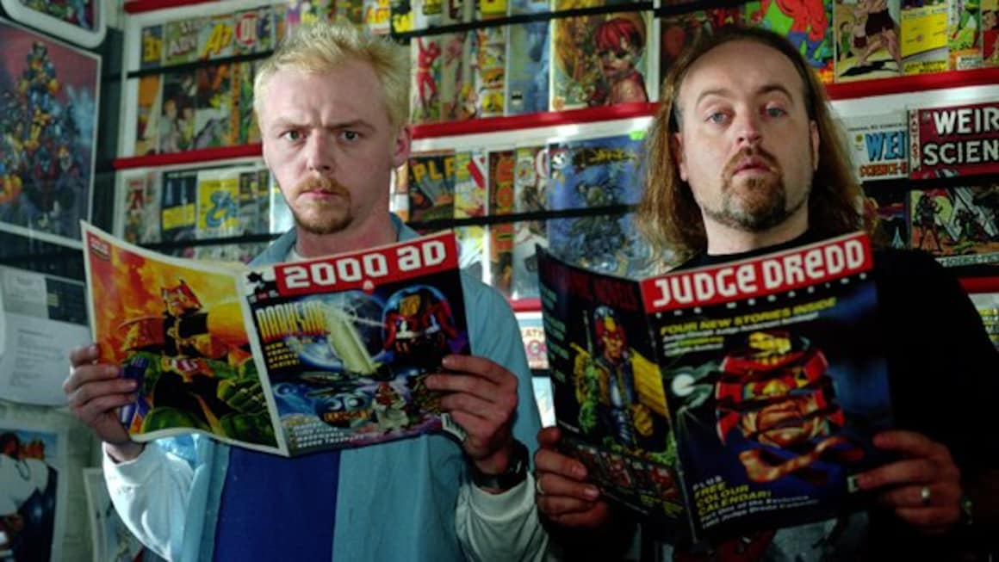
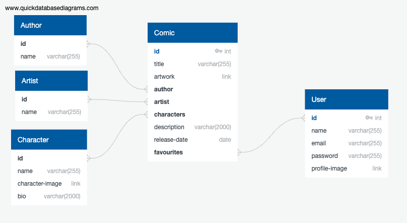
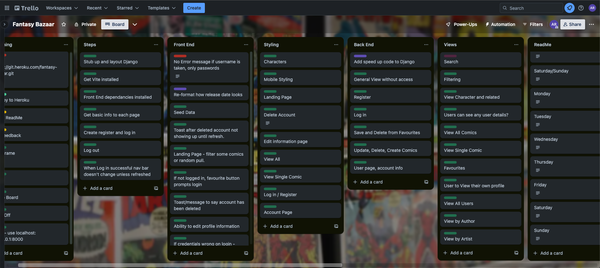
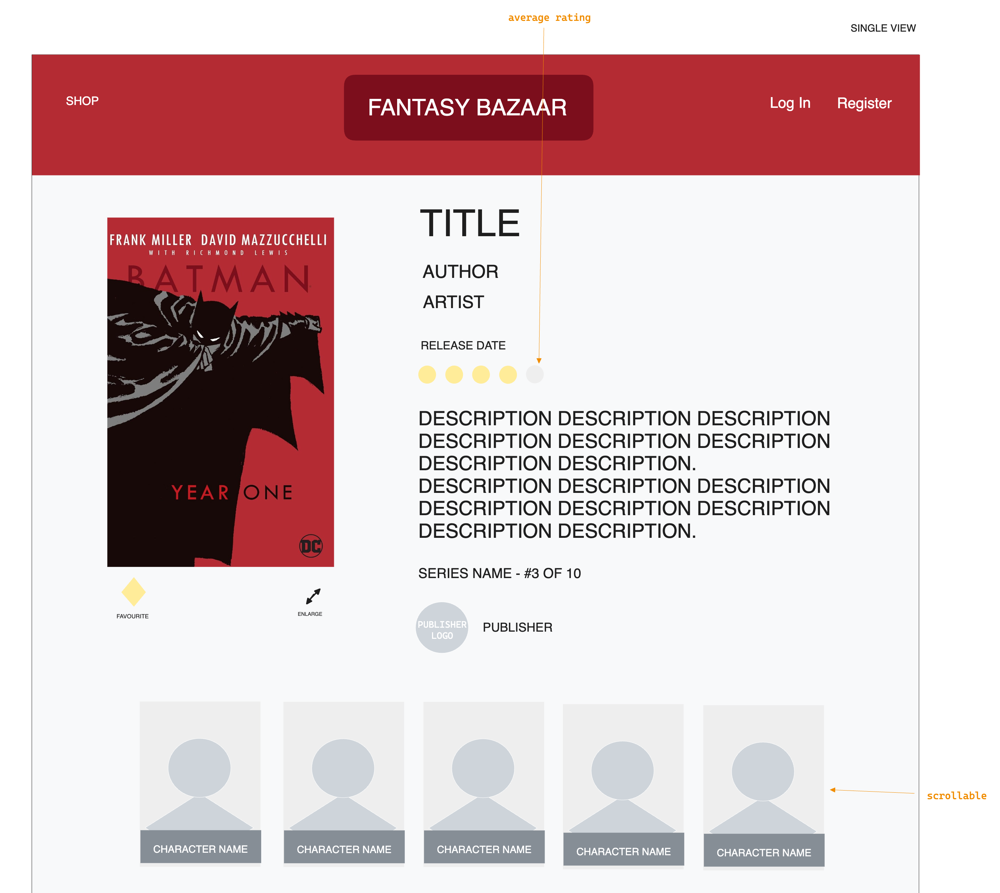
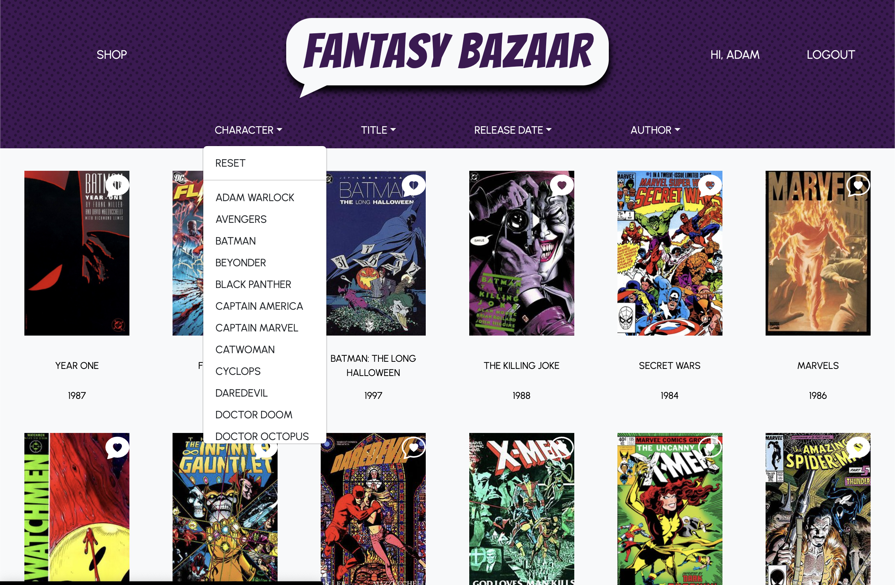
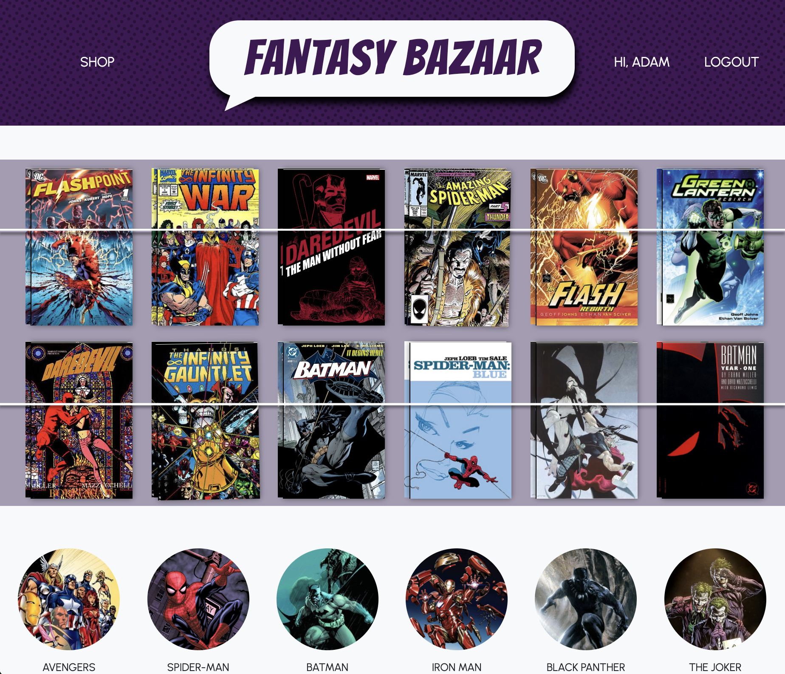
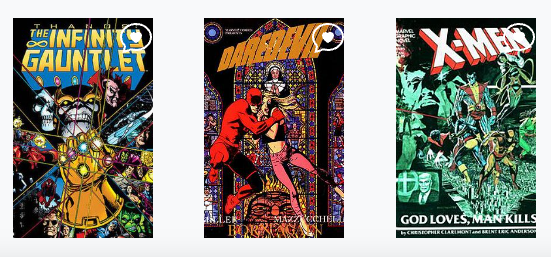

# Fantasy Bazaar

## Description

Fantasy Bazaar is a full stack application using a Python Django API and Django REST framework. It allows users to browse, get more information on, and add favourite comic books, with access to their own editable account.

## Deployment link

[Fantasy Bazaar Live Link](https://fantasy-bazaar-f1c5d94780c3.herokuapp.com/)


## Getting Started/Code Installation

#### Packages to download
```
Vite, django, djangorestframework, psycopg2-binary, pylint, djangorestframework-simplejwt, django-environ, django-cors-headers

axios, dotenv, react, react-bootstrap, react-dom, react-router-dom, sass, bootstrap-icons
```

## Timeframe & Working Team (Solo)

Solo project - 11 days.  
Started planning in the afternoon of Thursday 11th January for presentations on Monday 22nd January.


 ## Technologies Used

HTML, CSS, JavaScript, Python, Django, Django REST framework, PostgreSQL, Sass, Node.js, Vite, React, Axios, JSON, JWT, npm, Dotenv, React Bootstrap, Git, GitHub, Heroku, Bearer Tokens, Chrome DevTools.

Insomnia, Excalidraw, Quick DBD, Trello, VS Code.


## Brief

#### Overview

Build a full-stack application by making your own backend and your own front-end.

#### Technical Requirements

* Use a Python Django API using Django REST Framework to serve your data from a Postgres database.
* Consume your API with a separate front-end built with React.
* Be a complete product which most likely means multiple relationships and CRUD functionality for at least a couple of models.
* Implement thoughtful user stories/wireframes that are significant enough to help you know which features are core MVP and which you can cut.
* Have a visually impressive design to kick your portfolio up a notch and have something to wow future clients & employers.
* Be deployed online so it's publicly accessible.


## Planning

#### Ideas
My original idea came from a local business I had seen that was still using a Facebook page as their main site for their business and to show new releases. I wanted to have a website that could show new stock, let users search for titles, be able to see comics related to certain characters or authors, and have a list of favourites that they are interested in. 



#### Wireframing
I used the wireframe to map out the pages a user was going to need but also to be able to get an early idea of the design and layout as this can slow me down mid project. If I have a good idea ahead of time I’m much happier coding to that design and making tweaks when necessary for user flow as opposed to figuring it out mid- project.


#### ERD
Having created a very rough relationship diagram in a previous project, this was a great opportunity to do it properly and have a full understanding of the relationships I was going to need to create for everything to work for the user’s needs.




#### Trello
I found this such a useful tool to use over my notebook of lists (which still played a small part). Having an opportunity to think through the project as a whole ahead of time, and compartmentalise was extremely helpful. I also added to this as I went along to document what had been done each day, but I had which features were core features, what errors were still happening, and what was in progress. I like a list of things I can tick off so this was a win-win.




## Build/Code Process

#### Thursday Day 1 - Planning
Today was mostly spent on planning, I began with wireframing which pages I was going to need, how users would move through the site and a start on the layout for the pages. I coupled this with research across a few different comic book and book shop websites to get an idea on information that would be important to users, and colour schemes to not detract from the comics which tend to be quite busy and colourful. 



I made the ERD to understand how the information would be related, and began to start coding the basics of the back end and stub up the pages. 

#### Friday Day 2
Fully into the coding today, still on the back end I created user views, added a many to many relationship from the Comics to the Authors, and from the Comics to the Characters featured and ensured all paths were working through Insomnia. 
I connected the project to GitHub which happened later than it should have.
I found that one of my comic views was returning a 'NoneType’ error and found a missing `return` statement within an ‘if…else’. I was also worried there was a bigger error but it turns out I just hadn’t migrated my settings yet!

#### Saturday .5 /Sunday .5 - Day 3
I was having a problem getting data into React but this turned out to be a CORS Header error (more in WINS). With this fixed, I was able to access all the data from React and began populating what I was going to need on the All Comics page. 
I successfully set up the login page and users are able to log in. The registration page also allows users to register an account on the site and they can log in too. 

#### Monday Day 4
Continued to add functionality so that users can also log out, and for the navigation bar to behave accordingly and change the menu options depending on whether a user is logged in or out. 
Created a portfolio page for users to see their own details, and they also have the ability to delete their account from this page too. On choosing to delete their account, they are presented with a dialog box to double check they want to continue with deleting all their info.

#### Tuesday Day 5
Added the ability for a logged in user to favourite comics on the All Comics page, this led to a long afternoon of looking into an issue where the chosen comics didn’t align with the logged in user. 

#### Wednesday Day 6
The favourite icon changes when a user chooses it. I began refactoring some code to pass down user information from the App to the child components. Added functionality for users to edit their account details, but facing some issues with the PATCH request. Began some styling to get a better idea on the page flows. 

#### Thursday Day 7
Users being able to favourite and unfavourite comics now works. 
The `handleFavourite` function makes a copy of the comics. The addFavourite is an Axios PATCH request with the users Bearer Token to add the favourite into the list. `replaceComic` then finds the index number of the comic that matches the updated version and replaces it, and then sets state with the updated list.  
The `divertFavourite` function is to let users who aren’t logged in, know that they need to log in or create an account to save their favourites.

```javascript
async function handleFavourite(event, id) {
  event.preventDefault()
  const allComicsCopy = [...allComics]
  const updatedComic = await addFavourite(id)
  const replaceComic = allComicsCopy.findIndex(comic => comic.id === updatedComic.id)
  allComicsCopy[replaceComic] = updatedComic
  setAllComics(allComicsCopy)
}

// Run Toast
function divertFavourite(event) {
  event.preventDefault()
  setShowToast(true)
}
```

Added in Outlet Context to App and added props/params to the Nav component and the Outlet. This in turn helped with an ongoing issue where the account name for the logged in user would only show in the Nav bar on page reload. 
The user Account page had a bug that meant it would intermittently show information, completely wipe on page reload, and on returning to the page after the user had edited their information. This was due to an issue with the `views.py` file, and I needed to add in an `or` and restructure.

```python
class UserDetailView(RetrieveUpdateDestroyAPIView):
  queryset = User.objects.all()
  permission_classes = [IsAuthenticated]

  def get_serializer_class(self):
    if self.request.method == 'GET' or self.request.method == 'PATCH':
      return UserInfoSerializer
    return ComicListUserSerializer
```


#### Friday Day 8
Seeded in the comic book data to have more information to use and to get a better idea for the styling to come. This was also my first time properly using Chat GPT to source the information for the comics (I still input it manually). Added in code for a user to be able to view the comics they had added to favourites on their User Account page. 
Found some issues when the page refreshed and with navigating to certain pages, and found this was due to URLs appending themselves as there were missing `/`’s.
Added in React Bootstrap Toast messages for user errors. So if the user’s password is incorrect on login, if passwords don’t match when registering for an account, and when the user has successfully deleted their account, although this final toast has to show on a new page after the user has deleted their account and been redirected, so needs to be finalised.
I added to the styling for the React Bootstrap Toast and Modal elements. And added in layout styling for the Login, Register, User Account Edit and User Account pages. 

#### Saturday Day 9
Finalised the Toast message to appear after a user has deleted their account and been redirected. When the user confirms they want to delete their account on the React Bootstrap Modal, a message is placed in LocalStorage. The `useEffect` is waiting for a change in the location to ‘/register’, which will also occur once the user has chosen to delete their account. The ternary operator needs the LocalStorage to have a message and for the user to be on the registration page and it will then show the user a Toast message that everything has been successful. The function then removes the message from LocalStorage.

```javascript
const registerPage = useLocation()

  useEffect(() => {
    function deleteAccount() {
      if (registerPage.pathname === '/register') {
        localStorage.getItem('message')
        if (localStorage.getItem('message') !== null && registerPage.pathname === '/register') {
          setShowToastDEL(true)
          localStorage.removeItem('message')
        }
      }
    }
    deleteAccount()
  }, [registerPage])

  const [showToastDEL, setShowToastDEL] = useState(false)
  const toggleShowToastDEL = () => setShowToastDEL(!showToastDEL)
```

Added in a spinner for when pages are loading.
I styled the home screen to resemble the wall of a comic book shop and had fun adding in extra styling to make it look more realistic, by adding extra comics behind, tilting a few and adding the string (two SVG lines) to hold the comics on the shelf. Got accustomed to how to create and style simple SVG elements too. 
I added a separate loader for a random selection of 12 comics, that will randomise on each load/visit to populate the shelves. It started out as 10 comics, hence the function name, but then styling required more. These also link to the individual comics pages.

```javascript
export async function getRandomTen() {
  try {
    const res = await axios.get('/api/comics/')
    const allComicData = res.data
    const allComicsCopy = [...allComicData]
    const randomComicsTen = allComicsCopy.sort(() => .5 - Math.random()).slice(0, 12)
    return randomComicsTen
  } catch (error) {
    console.log(error)
  }
}
```

Began adding filters to the All Comics page for users to filter the page alphabetically by title (A to Z, and Z to A), and by release date (new to old, old to new). I then began on the filters to see comics by Characters and Authors.

#### Sunday Day 10
Final push! I realised my efforts late the night before to source a character list were a hard way to go about it. I was able to source the Character and Author lists easily to populate the filter menus and let user’s filter the page by each. I had some issues when the comic list would dwindle with each selection but managed to quickly find that I wasn’t clearing the list properly at the start of the function between each click. 

```javascript
async function characters(name) {
  setFilterComics('')
  setAllComics(allComics)
  const allComicsCopy = [...allComics]
  const filterChar = allComicsCopy.filter(comics => comics.characters.find(char => char.name === name))
  setFilterComics(filterChar)
  return filterChar
}
```



I added in another field to the Character model for images and added in the images, so that the main landing page can have a better looking list of characters to choose from. Populated the character pages and added in functionality so that users can see related comics on the Character’s page that also directly link to the comics. 
Finalised styling for all pages, and more mobile styling. Due to the layout of the Nav bar, this led to me learning about flex ordering, which as a massive flex-box fan, was very exciting!
Added in a footer with links and deployed to Heroku.


## Challenges

I had set up an `axios.delete` for users to be able to delete their accounts if they would like to. I was getting an error message that the URL was failing and I could see that instead of the URL I was sending, the new URL was being added to the end of the original URL. 
After trial and error and then some Googling, I found that I needed to add a leading slash to the URL. Otherwise, it is a relative path and appends itself to the end, instead of replacing the URL. When this came up again, I knew what to look for and where.

```javascript
export async function deleteUser(id) {
  localStorage.setItem('message', 'DELETED')
  await axios.delete(`/api/auth/user/${id}/`, {
    headers: {
      'Authorization': 'Bearer ' + getToken()
    }
  })
  // console.log('complete at user action')
  return redirect('/register')
}
```

I got caught out by some curly brackets when trying to make a PATCH request to add and remove favourites from a user account. I needed to send the data and to include the Bearer Token and missed that these needed to be two separate objects.

```javascript
export async function addFavourite(id) {
  const res = await axios.patch(`/api/comics/${id}/favourite/`, {
      data: {
        'favourites': []
      }
    },
    {
      headers: {
        'Authorization': 'Bearer ' + getToken()
      }
    }
  )
  return res.data
}
```

The user favourites was one of the longer challenges during this project. One of the other issues I was facing was a difference in the information being sent, and the information being returned, which meant adding and removing favourites was intermittent. When you added a comic as a favourite and when you took it off, you would get a list returned for one and an object for another. So you could unfavourite a comic, but not favourite a comic.

```python
class ComicFavView(UpdateAPIView):
  queryset = Comic.objects.all()
  serializer_class = ComicSerializer
  permission_classes = [IsAuthenticated]


  def patch(self, request, pk):
    comic = self.get_object()


    if request.user in comic.favourites.all():
        comic.favourites.remove(request.user)
    else:
        comic.favourites.add(request.user)


    comic.save()
    serializer = ComicListSerializer(comic)
    return Response(serializer.data, status=201)
```


## Wins

#### User favourites
Continuing with the favourites saga, this loader function means that a user is able see what’s in their favourite list on their User Account page. The Axios request fetches all the comic details, filters down into the favourites, and returns the comics that have the current user ID present.

```javascript
export async function filteredComicData() {
  try {
    const res = await axios.get('/api/comics/')
    const allComicData = res.data
    const favouriteComics = allComicData.filter(comicFav => comicFav.favourites.find(fav => fav.id === activeUser()))
    return favouriteComics
  } catch (error) {
    console.log(error)
  }
}
```

#### Handling Cross-Origin Resource Sharing
I was getting a ‘202 OK’ error when trying to access the data in Django from React. This also gave a CORS HEADER error. Research showed that I needed to add in a `pipenv install django-cors-headers` package , add to INSTALLED_APPS, add in some MIDDLEWARE and `CORS_ORIGIN_ALLOW_ALL = True` in Project > settings.py to be able to make a HTTP request from a different origin.

#### Landing/Home Page & Styling
I always enjoy styling but enjoyed trying to add a bit more to the landing page, and with a few tweaks wanted to make it look like it had a slightly realistic feel to it. So there are two comics with a slight rotation, an addition of more comics behind and a slight offset to the top one to see more behind. A white strip on top to make it look like there's content inside, and some shadow added to the comics and the string across the front. 

```
.home-comics-image {
  @include flex(row, flex-start, flex-end);
  height: 184px;
  width: 120px;
  background-repeat: no-repeat;
  background-position: center;
  background-size: cover;
  margin: 0.75px 0 0 6px;
  border-left: 1px solid black;
  border-top: 0.5px solid white;
  box-shadow: 0px 0px 7px rgb(0, 0, 0, 0.5);
}


.comic-both-shelves div:nth-child(4) div {
  transform: rotate(1deg);
  margin: 2px 0 0 4px;
}


.comic-both-shelves div:nth-child(8) div {
  transform: rotate(359deg);
  margin: 2px 0 0 6px;
}
```



#### React Bootstrap
I had used this before but would do lots of styling in CSS to shoehorn in changes. This time around, I was able to use a lot more of the inbuilt functionality of Toasts, Modals and Dropdown menus and got a better handle on how this can be done. 


## Key Learnings/Takeaways

#### Chrome DevTools
Related to the appending URLs above, I started to use the Network information provided by Google Chrome DevTools more as this would show me the URL that was being used, which in turn meant I could see that URLs were appending to one another rather than replacing.

#### DRY Code
Whilst not completely devoid of moisture, I was conscious of using more and more reusable code. Whether this was a function, information being mapped into React, or styling page sections.

#### Wireframing
From a personal project on the side, I learnt that I work much better with a clear idea on layouts and some styling, otherwise I find myself stuck on these elements mid-project. Spending the time ahead of beginning a project on a wireframe, not just for user flow but also for rough page layouts, and some font and colour choices, means that I’m more comfortable getting pixel perfect and ensuring features are included in the project. 

#### Trello
Using Trello as part of my process meant that I had a lot less scribbled notes and clear ideas of what I’m working on and what I needed to do next. 


## Bugs

On registration there is a Toast message for users if their password and password confirmation don’t match, but the Toast error also comes up if the username is taken, so this needs to be added in to avoid user confusion. I’ll need to set up some functionality to reference the specific error message response.

More styling but the release date needs to be reformatted to be more user friendly and readable. Also the Login and Registration boxes can overlap on mobile landscape view. 


## Future Improvements

* Move favourite icons on the main page or give them slightly different styling as they don’t stand out as much on a busy comic book front page.



* Add in user reviews, and filter comics by rating scores.
* Add in the option to search by typing, not just filters.
* The ability for users to upload a profile picture.
* Add in the information, or link to a third party API, to add in the related movies/shows for each character.
* A bit more styling to tweak everything to be more user friendly, hover changes on Login and Register buttons for example. 
* In single comic view, have the functionality for users to like/unlike comics too. 
* Speed up loading times of comics and information.
